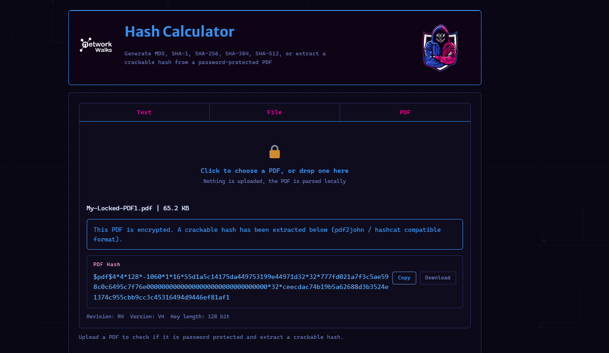

# 🔐 Networkwalks B082 - Week 3

## Authentication Attacks & Password Cracking

## 📌 Project Overview

This project focuses on executing password recovery and dictionary-based cracking attacks using John the Ripper (JTR), Johnny GUI, and Networkwalks online tools. 
The purpose of the lab is to understand how cryptographic hashes are extracted from protected files (such as PDFs) and to demonstrate why weak or common passwords pose a significant security risk. 
The lab is designed to use both local software and web-based utilities so that password hashes can be isolated and rapidly compared against wordlists to successfully recover the original plain-text credentials.

A fundamental concept reinforced in this module is the critical distinction between two cryptographic processes:
*   **Encryption:** A two-way function designed to protect sensitive information; encrypted data can be reliably decrypted back into plain text if the user possesses the correct cryptographic key.
*   **Hashing:** A one-way mathematical function used to validate information. It scrambles plain text to produce a unique message digest that cannot be natively reversed or "decrypted" without utilizing cracking techniques.

## 🔓 W3-PM1 — Password Cracking with JTR

The first mandatory module leveraged **John the Ripper (JTR)** to execute an authorized password extraction and recovery process on secured PDF documents.

The workflow covered setting up the local environment, extracting the target PDF hashes, running dictionary candidates, analyzing the output, and finally validating the cracked passwords against the original files.

### Key Takeaway
The security of a protected document is fundamentally tied to the strength of its password and encryption standard. Additionally, cracked credentials must always be manually tested to verify successful recovery.

---

## 🔑 W3-PM2 — Password Cracking with Networkwalks Tools

The second mandatory module transitioned to using the web-based **Networkwalks Hash & Password Cracker** to perform structured dictionary attacks.

This phase documented the full recovery lifecycle—from extracting the initial hashes to cracking and verifying the passwords—across three assigned target PDFs.

## 📸 Visual Evidence

### Hash Extraction

The following screenshot demonstrates the Networkwalks Hash Calculator successfully extracting a crackable `$pdf$` hash from the protected `My-Locked-PDF1.pdf` file.

### Successful Recovery & Flag Capture

The following image proves successful password recovery, showing the decrypted PDF displaying the captured flag and a "Congratulations!" message.

---

This secondary flag was captured after successfully executing a dictionary attack, demonstrating the importance of patience and selecting the right wordlist

---

### Key Takeaway
While the specific tool or interface may change, the core methodology of password recovery remains the same: accurate hash extraction, effective candidate wordlists, and final verification are the keys to success.

---

## 🤖 W3-OPTIONAL1 — AI Integration with Claude Desktop & HexStrike MCP

This optional exercise explored an **AI-driven security workflow** by integrating Claude Desktop with the HexStrike Model Context Protocol (MCP).

The documented process covers the complete setup lifecycle: initial software installation, preparing dependencies, configuring the MCP, verifying server connectivity, and executing the designated password-cracking assignments.

---

### Challenge Encountered
Setting up the dependencies and finalizing the MCP configuration required significant troubleshooting before the environment became operational. I intentionally preserved the evidence of these initial setup hurdles in the documentation, as recording errors and their subsequent fixes is essential for demonstrating realistic, reproducible lab work.

---

## 🌐 W3-OPTIONAL2 — Web Authentication Assessment

The final optional module involved conducting an authorized authentication attack against a web portal.

I tested various wordlists and applied multiple troubleshooting techniques throughout the process. Ultimately, **no valid credentials were recovered during the testing window**, and subsequent analysis revealed connectivity limitations with the target infrastructure.

Consequently, the status of this module is officially recorded as:

### ⚠️ Best-Effort Attempt — No Valid Password Recovered

It is important to emphasize that failing to recover a password does **not** guarantee an account is secure. It simply indicates that the specific candidate lists and attack vectors applied during this session were unsuccessful.

All published artifacts for this module, including screenshots and output logs, have been fully sanitized and redacted for safe public disclosure.

---

## 🛠️ Core Skills Developed

### Cryptography & Password Recovery
- Operating John the Ripper (JTR)
- Extracting cryptographic hashes from locked PDFs
- Executing dictionary-based password attacks
- Managing and optimizing candidate wordlists
- Validating and manually testing recovered credentials

### AI-Integrated Security Workflows
- Utilizing Claude Desktop for security tasks
- Leveraging HexStrike AI capabilities
- Configuring Model Context Protocol (MCP) servers
- Resolving and debugging software dependencies
- Testing and verifying tool integration and connectivity

### Web Authentication Assessment
- Analyzing HTTP login request structures
- Curating and deploying targeted wordlists
- Troubleshooting Hydra brute-force workflows
- Objectively evaluating and interpreting attack outcomes

### Professional Documentation & Reporting
- Systematically gathering project evidence
- Capturing and organizing screenshot artifacts
- Archiving terminal commands and system outputs
- Redacting sensitive information for public repositories
- Drafting clear, structured technical documentation
- Transparently reporting unsuccessful or best-effort attempts

---

## 🔗 Tools & Resources

The following tools, software, and resources were utilized to conduct the password cracking and authentication assessment exercises for this module:

* **[John the Ripper (JTR)](https://www.openwall.com/john/)**: Open-source password security auditing and password recovery tool used for offline dictionary attacks.
* **[Johnny GUI](https://openwall.info/wiki/john/johnny)**: Graphical user interface for John the Ripper, used to streamline the hash-cracking workflow.
* **[Networkwalks Hash Calculator](https://networkwalks.com/hash-calculator/)**: Web-based utility utilized to extract crackable `$pdf$` hashes from password-protected documents.
* **[Networkwalks Password Cracker](https://networkwalks.com/password-cracker/)**: Web-based tool used to perform dictionary-based hash cracking directly in the browser.
* **[OnlineHashCrack](https://www.onlinehashcrack.com/tools-pdf-hash-extractor.php)**: Online extraction service used to convert locked PDFs into JTR/Hashcat compatible hash formats.
* **Claude Desktop**: AI assistant utilized for configuring and executing AI-assisted security workflows.
* **HexStrike MCP**: Model Context Protocol server integrated with Claude to manage automated security tasks.
* **Hydra**: Parallelized network login cracker used for testing web authentication portals.

---

## 👤 Author

